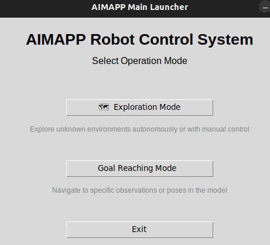
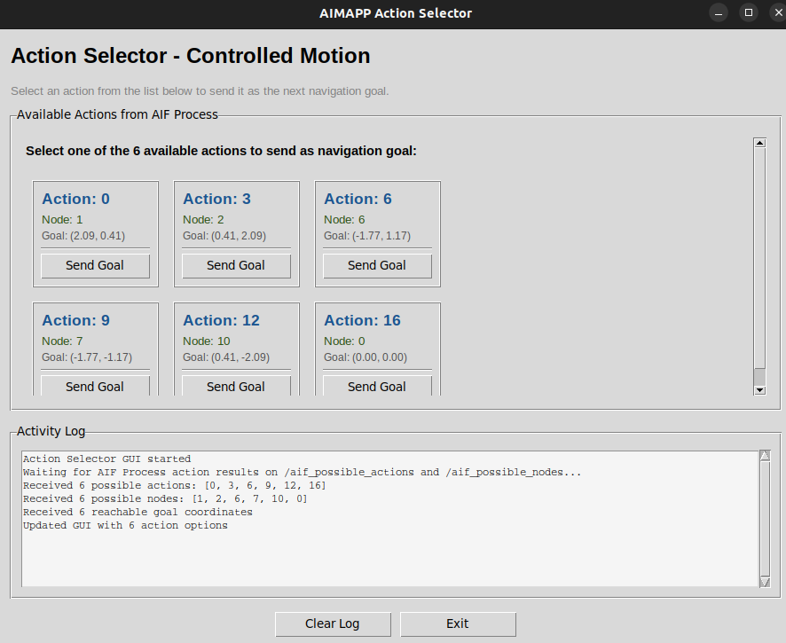

# AIMAPP Project 

This repository contains the code for the Active Inference (AIF) Mapping and Planning project (AIMAPP) 
It includes localisation, mapping and decision making to explore or reach given goals (as panorama observations or poses -not tested-). 

It requires ubuntu 22.04 and ros2 humble or is configured to run inside a Docker container for ease of setup and consistent environments.

A general audience blog can be found on our [Decide blog](https://decide.ugent.be/blog/2025-09-10-robot-nav-aif-rw/) with some aditional videos

##### Table of Contents  
[Overview](##Overview)  
[Docker](##Docker)  
[Locally](##Locally)  
[Start the project](##Start-the-project)  
[Modifying Agent and MCTS Parameters ](##Modifying-Agent-and-MCTS-Parameters)
[example usage](##example-usage)
[cite us](##cite-us)

<!-- <a name="Overview"/> -->
## Overview  <a name="Overview"></a>

This project enables autonomous agents to explore and navigate unknown environments using Active Inference and Monte Carlo Tree Search (MCTS) for decision making. The project is modular and can be extended for different robots and environments.

## Docker <a name="Docker"></a>
### Prerequisites

Before you begin, ensure you have the following installed:

1.  **Git:** To clone the repository.
2.  **Docker:** Docker Engine or Docker Desktop. Installation instructions can be found on the [official Docker website](https://docs.docker.com/get-docker/).

### Setup and Installation

1.  **Clone the Repository:**
```bash
git clone aimapp git_link
cd aimapp
```

2.  **Build the Docker Image:**
    * This command builds the image using the `Dockerfile` in the current directory and tags it as `aimapp`.
```bash
docker build -t aimapp .
```

### Usage

#### Start the docker
**Make the script executable (if needed):**
```bash
chmod +x launch_docker.sh
```

**Run the container:**
```bash
bash launch_docker.sh 
```
* mounts volumes (for input/output data), so the aimapp repo can be modified locally and run in your docker.
once it finished colcon build 
press ctrl+p ctrl+q to detach the window and let the docker run in the background

to access the container:
```bash
docker exec -it aimapp bash
```

## Locally <a name="Locally"></a>
### Prerequisites

Before you begin, ensure you have the following installed:

1.  **Ubuntu 22.04** 
2.  **Ros2 humble** 

### Setup and Installation

```bash
cd aimapp/aimapp
pip install -e .
```
```bash
cd /home/YOUR_ROS_WP/src/ \
&& git clone https://github.com/ROBOTIS-GIT/turtlebot3_simulations -b humble \
&& git clone https://github.com/aws-robotics/aws-robomaker-small-warehouse-world -b ros2 \
&& git clone https://github.com/aws-robotics/aws-robomaker-small-house-world -b ros2 
```

Make sure the robot we are calling exist (we created a waffle robot with 3 cameras, to change the turtle version, go in spawn_turtle_launch.py)
-> look at the `COPY` in the Dockerfile to copy paste the modifications done to the worlds and turtlebot3 in the appropriate locations (to have all our worlds + top view camera -optional-).

If you are using Ricoh theta X:
sudo apt install gphoto2
sudo apt install libgphoto2-6

## Start the project <a name="Start-the-project"></a>

### GUI Launcher 

The project includes a graphical user interface (GUI) for easy launching of different operational modes. The GUI provides a first interface to configure and launch exploration or goal-reaching tests. Only the main parameters are given as variables but it is faster.

#### Available GUI Modes

**Main GUI Launcher:**
```bash
cd /path/to/ros_workspace  # Important: Launch from ROS workspace root
python3 src/aimapp/command_GUI_files/GUI_main.py
```

<p align="center">
 
</p>

This launches the main menu with two options:

##### 1. Exploration Mode (`launch_exploration_gui.py`)
Choose between two exploration strategies:

- **Controlled Motion Exploration:**
  - Action process dissociated from model process
  - Requires manual goal sending via GUI or terminal
  - Ideal for environments where obstacles can't be detected by Lidar
  - Uses `launch_model_as_action_robot.sh`
  - Includes Action Selector GUI for interactive node selection

- **Fully Autonomous Exploration:**
  - Complete autonomous exploration without manual intervention
  - Agent makes all decisions independently
  - Best for well-defined environments with reliable Lidar coverage
  - Uses `launch_autonomous_exploration.sh`

**Configurable Parameters:**
- Test ID (optional): Load existing model from previous test
- Influence Radius (default: 1.6): Radius of influence of a state
- Number of Actions (default: 17): Possible action directions
- Lookahead Node Creation (default: 8): Consecutive states created with Lidar range
- Skip Double Check: Option to skip re-observation of visited nodes (faster but less robust)

##### 2. Goal Reaching Mode (`launch_goal_gui.py`)
Navigate to a specific goal observation or pose:

- **Controlled Goal Reaching:**
  - Manual control mode with user interaction required
  - Uses `launch_model_as_action_robot.sh` with goal parameters

- **Fully Autonomous Goal Reaching:**
  - Complete autonomous navigation to goal
  - Agent makes all decisions independently
  - Uses `launch_autonomous_exploration.sh` with goal parameters

**Goal Specification Options:**
- **Objective Text:** Use Gemini AI to find goal from text description (e.g., "radiator", "door")
- **Goal Observation ID:** Specify the exact observation ID to reach
- **Goal Pose ID:** Specify the exact pose ID to reach (alternative to observation)
- **Test ID (required):** Load existing model from previous exploration
- **Starting Node ID:** Specify where to start (default: -1 = latest node in model)

**Example Usage:**
1. Run previous exploration (test_id=5) to build a map
2. Open Goal Reaching GUI
3. Enter test_id=5 and objective="door"
4. Select Autonomous mode
5. Robot navigates autonomously to the door observation


### Robot Usage - Launch Scripts for exploration

For **robot deployment** (ideal in areas where obstacles can't be detected by the Lidar and we have no bumper on the robot -Husarion-). 


#### Robot Side: `launch_all.sh`
This script launches all necessary nodes on the robot:

```bash
cd /path/to/aimapp
./launch_all.sh
```

This will open 8 terminal tabs with:
- Joy2Twist gamepad controller
- Node visualizer
- Rosbot startup and odometry shifting (Husarion)
- Nav2 navigation (Husarion)
- Minimal agent
- Data saving node
- AIF Process action sender (interactive) -see image below-
- Goal sender terminal (interactive) 
<p align="center">

</p>

**Sending navigation goals:**

The nav2_client_node_goal.py runs in continuous mode, allowing multiple goals without restart. Must be adjacent nodes, this is still exploration, not goal reaching in the proper sense:

```bash
# Method 1: Using helper script
./send_next_node_goal.sh 1    # Send goal node 1
./send_next_node_goal.sh node_goal_as_int  

# Method 2: Direct topic publish
ros2 topic pub --once /nav2_client_goal_node std_msgs/msg/Int32 "data: 1"
```

#### Laptop Side: `launch_all_laptop.sh`
This script launches monitoring and visualization on the laptop:

```bash
cd /path/to/aimapp
./launch_all_laptop.sh
```

This will open 3 terminal tabs with:
- SLAM launch
- RViz2 with manual motion configuration
- Odometry monitor (checks robot connection status)

All logs (except odometry) are saved to `~/aimapp_logs/YYYYMMDD_HHMMSS_laptop/`

The odometry monitor continuously displays position updates. If updates stop, you may have lost contact with the robot.
---

### Simulation Usage

Start the world
```bash
source install/setup.bash
ros2 launch aimapp warehouse_launch.py
```

OR
```bash
export GAZEBO_MODEL_PATH=`pwd`/models
source /usr/share/gazebo/setup.sh
ros2 launch aws_robomaker_small_house_world small_house.launch.py gui:=true
```

**Spawn the agent**
```bash
source install/setup.bash 
ros2 launch aimapp spawn_turtle_launch.py x:=0.0 y:=0.0
```
**Start Nav2** (optional) -- If started has to start almost simultaneously as the world and spawn due to simulation time reliance.
```bash
source install/setup.bash 
ros2 launch aimapp nav2_humble_launch.py
```

**Start the agent**
```bash
source install/setup.bash 
ros2 launch aimapp agent_launch.py
```

**Record position GT/believed_odom over time** (optional)
```bash
source install/setup.bash 
ros2 run aimapp simulation_overview_data_save.py
```

**Start Rviz** (optional)
```bash
rviz2 -d src/aimapp/aimapp/rviz/nav2_default_view.rviz 
```

### Start with existing model or goal

```bash
ros2 launch aimapp agent_launch.py model_dir:=path_to_model_dir goal_path:=path_to_your_image_file.jpg_png
```

`path_to_model_dir` has to be a directory leading to a model.pkl file. 
`path_to_your_image_file.jpg_png` currently we expect to receive a panorma has saved by the model during exploration

## Modifying Agent and MCTS Parameters <a name="Modifying-Agent-and-MCTS-Parameters"></a> 

You can customise the agent's behaviour and the MCTS planning process by editing the following variables in the code.

### 1. Agent Parameters (`Ours_V5_RW` class)

Located in: `aimapp/aimapp/model/V5.py`

```python
class Ours_V5_RW(Agent):
    def __init__(self, 
                 num_obs=2, 
                 num_states=2, 
                 dim=2, 
                 observations=[0, (0,0)], 
                 lookahead_policy=4,
                 n_actions=6,
                 influence_radius=0.5, 
                 robot_dim=0.25,
                 lookahead_node_creation=3):
        # ...existing code...
```

- **num_obs**: Number of expected observations (at start)(min=2 to have a matrix).
- **num_states**: Number of expected states at start (min=2 to have a matrix).
- **dim**: How many different observations we can get (by default 2 for visual ob and pose).
- **observations**: The starting observations (initialisation).
- **lookahead_policy**: Maximum depth for the simulation (rollout) phase --> Planning horison for the agent (unused variable).
- **n_actions**: Number of possible actions (sequence 360 in ranges for n_actions, unpair value add the "stay" action).
- **influence_radius**: Radius of influence of a state (under that value, no states will be created).
- **robot_dim**: Physical dimension of the robot (patching value to consider walls while creating new states).
- **lookahead_node_creation**: How many consecutive state can be created with the lidar range.

**To modify these, change the default values in the constructor or pass new values when instantiating the agent.**

### 2. MCTS Parameters

Here is an example of what is happening during the decision process:
<p align="center">

</p>

Also in `aimapp/aimapp/model/V5.py`, look for:

```python
# MCTS PARAMETERS
self.num_simulations = 30      # Number of MCTS simulations per planning step 
self.c_param = 5               # Exploration parameter for MCTS
```

- **num_simulations**: Number of MCTS simulations per planning step (the bigger, the further it imagines, but the slowest it is).
- **c_param**: Exploration parameter for MCTS (higher values encourage exploration).

**To modify these, change the values in the class where they are set.**


### 3. Sensory process and motion process

#### Sensor process
The sensory process can be modified at will. 

Currently our observation specific folder is: `aimapp/aimapp/obs_transf` and we expect a list of image as input to stitch them into a single view. 
The main code is: `aimapp/aimapp/obs_transf/observation_match.py`, it treats the data (stitch the list of image) and compare them with an SSIM. 

As long as the process outputs a number (or a few numbers if we modify the model to receive multiple observations), the model can use it. 
You can output as many numbers as desired, as long as a new observation gets an incremented value starting from 0. 

Note: Receiving many observations means that the oldest ones will get forgotten if the position is not re-visited. This is due to the probabilitic nature of the storage of information, as the observation pool grow, previously certain observation see their probability stretched finer with dimentionality growth (new states and observations added). The system was tested with up to different 61 observations. Past 100, the visualisation_tool will raise an error if you are trying to plot them on map (we only have 100 different markers). 


If you which to create a new ROS action, your action has to be:

```bash
float32[] goal_angles
int32 n_actions
---
sensor_msgs/Image[] panorama
float32[] pano_scan
---
float32 current_stop
```

what the input refers to will be up to you, however we expect the sensor process to outputs a list of obstacle distance per (pair) number of actions you have. 
Panorama should be a list of Ros images.


#### Motion process

Currently we use Nav2 or a potential field provided in this folder and already started by default in `agent_launch.py`. 
Nav2 can be started using `nav2_humble_launch.py`, the parameters can be found in `aimapp/aimapp/params/nav2_humble_params.yaml`. There is no mapping launched with our nav2. 

The potential field has not been finely tuned and is only there as a backup to quickly test the model, it is highly imprudent to use it in the real world if the robot doesn't have bumpers. 

The motion process can be modified by anything as long as teh action returns:

```bash
geometry_msgs/Point goal_pose
---
float32[] pose
bool goal_reached
---
# Feedback
float64 dist_to_goal 
```

The model uses the boolean to know if we reached the pose and determine using pose wether the distance is acceptable or not (based on `robot_dim` and states `influence_radius` variables). 


<!-- ## example usage <a name="example-usage"></a>
<p align="center">
<video src="/uploads/fc2b4ce40f67a432525ab0f4f68cc692/demo_reach_aerial_drone_start.mp4", width='500px'></video>
</p> -->
