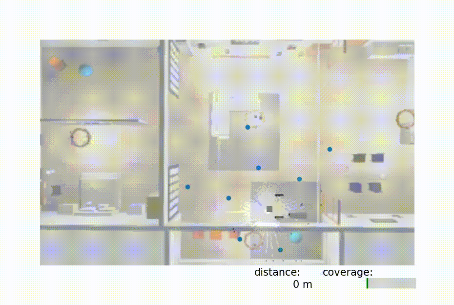
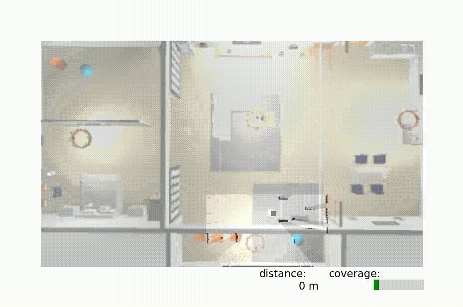
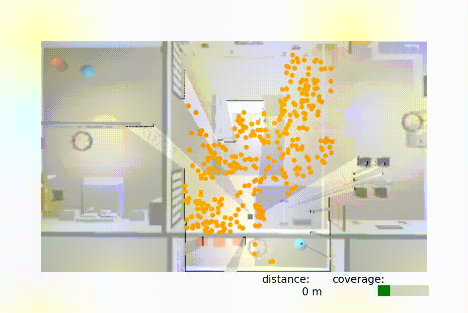
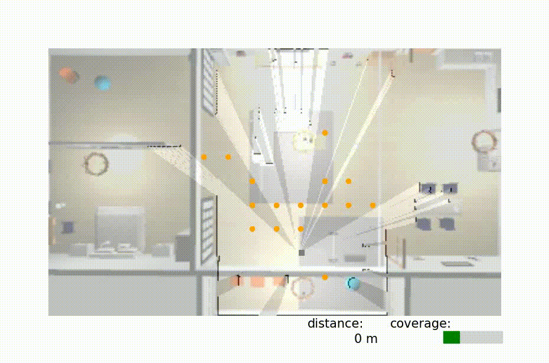

# Map DM Nav Project 

This repository contains the code for the Active Inference (AIF) Decision Making, localisation and mapping (Map DM Nav) project. 
It requires ubuntu 22.04 and ros2 humble or is configured to run inside a Docker container for ease of setup and consistent environments.


##### Table of Contents  
[Overview](##Overview)  
[Docker](##Docker)  
[Locally](##Locally)  
[Start the project](##Start-the-project)  
[Modifying Agent and MCTS Parameters](##Modifying-Agent-and-MCTS-Parameters)  
[Extra Features](##Extra-Features)\
[How to cite us](##Cite-Us)


<!-- <a name="Overview"/> -->
## Overview  <a name="Overview"></a>

This project enables autonomous agents to explore and navigate unknown environments using Active Inference and Monte Carlo Tree Search (MCTS) for decision making. The project is modular and can be extended for different robots and environments.

It's exploration performance have been evaluated against FAEL, Gbplanner and Frontiers. 

$~~~~~~~~$ Our AIF exploration model    vs   Frontiers
<p align="center">
 | 
</p>
vs Gbplanner  vs FAEL
<p align="center">
 | 
</p>

A general introduction to the model can be found on the blog post [Active Inference for Robot Autonomous Navigation](https://decide.ugent.be/blog/2025-09-10-robot-nav-aif-rw)

## Docker <a name="Docker"></a>
### Prerequisites

Before you begin, ensure you have the following installed:

1.  **Git:** To clone the repository.
2.  **Docker:** Docker Engine or Docker Desktop. Installation instructions can be found on the [official Docker website](https://docs.docker.com/get-docker/).

### Setup and Installation

1.  **Clone the Repository:**
```bash
git clone map_dm_nav git_link
cd map_dm_nav
```

2.  **Build the Docker Image:**
    * This command builds the image using the `Dockerfile` in the current directory and tags it as `map_dm_nav`.
```bash
docker build -t map_dm_nav .
```

### Usage

#### Start the docker
**Make the script executable (if needed):**
```bash
chmod +x launch_docker.sh
```

**Run the container:**
```bash
bash launch_docker.sh 
```
* mounts volumes (for input/output data), so the map_dm_nav repo can be modified locally and run in your docker.
once it finished colcon build 
press ctrl+p ctrl+q to detach the window and let the docker run in the background

to access the container:
```bash
docker exec -it map_dm_nav bash
```

## Locally <a name="Locally"></a>
### Prerequisites

Before you begin, ensure you have the following installed:

1.  **Ubuntu 22.04** 
2.  **Ros2 humble** 

### Setup and Installation

```bash
cd map_dm_nav/map_dm_nav
pip install -e .
```
```bash
cd /home/YOUR_ROS_WP/src/ \
&& git clone https://github.com/ROBOTIS-GIT/turtlebot3_simulations -b humble \
&& git clone https://github.com/aws-robotics/aws-robomaker-small-warehouse-world -b ros2 \
&& git clone https://github.com/aws-robotics/aws-robomaker-small-house-world -b ros2 
```

Make sure the robot we are calling exist (we created a waffle robot with 3 cameras, to change the turtle version, go in spawn_turtle_launch.py)
-> look at the `COPY` in the Dockerfile to copy paste the modifications done to the worlds and turtlebot3 in the appropriate locations (to have all our worlds + top view camera -optional-).

If you are using Ricoh theta X:
sudo apt install gphoto2
sudo apt install libgphoto2-6

## Start the project <a name="Start-the-project"></a>
Start the world
```
source install/setup.bash 
ros2 launch map_dm_nav warehouse_launch.py
```

OR
```
export GAZEBO_MODEL_PATH=`pwd`/models
source /usr/share/gazebo/setup.sh
ros2 launch aws_robomaker_small_house_world small_house.launch.py gui:=true
```

**Spawn the agent**
```
source install/setup.bash 
ros2 launch map_dm_nav spawn_turtle_launch.py x:=0.0 y:=0.0
```
**Start Nav2** (optional) -- If started has to start almost simultaneously as the world and spawn due to simulation time reliance.
```
source install/setup.bash 
ros2 launch map_dm_nav nav2_humble_launch.py
```

**Start the agent**
```
source install/setup.bash 
ros2 launch map_dm_nav agent_launch.py
```

**Record position GT/believed_odom over time** (optional)
```
source install/setup.bash 
ros2 run map_dm_nav simulation_overview_data_save.py
```

**Start Rviz** (optional)
```
rviz2 -d src/map_dm_nav/map_dm_nav/rviz/nav2_default_view.rviz 
```

### Start with existing model or goal

```
ros2 launch map_dm_nav agent_launch.py model_dir:=path_to_model_dir goal_path:=path_to_your_image_file.jpg_png
```

`path_to_model_dir` has to be a directory leading to a model.pkl file. 
`path_to_your_image_file.jpg_png` currently we expect to receive a panorma has saved by the model during exploration

## Modifying Agent and MCTS Parameters <a name="Modifying-Agent-and-MCTS-Parameters"></a> 

You can customise the agent's behaviour and the MCTS planning process by editing the following variables in the code.

### 1. Agent Parameters (`Ours_V5_RW` class)

Located in: `map_dm_nav/map_dm_nav/model/V5.py`

```python
class Ours_V5_RW(Agent):
    def __init__(self, 
                 num_obs=2, 
                 num_states=2, 
                 dim=2, 
                 observations=[0, (0,0)], 
                 lookahead_policy=4,
                 n_actions=6,
                 influence_radius=0.5, 
                 robot_dim=0.25,
                 lookahead_node_creation=3):
        # ...existing code...
```

- **num_obs**: Number of expected observations (at start)(min=2 to have a matrix).
- **num_states**: Number of expected states at start (min=2 to have a matrix).
- **dim**: How many different observations we can get (by default 2 for visual ob and pose).
- **observations**: The starting observations (initialisation).
- **lookahead_policy**: Maximum depth for the simulation (rollout) phase --> Planning horison for the agent (unused variable).
- **n_actions**: Number of possible actions (sequence 360 in ranges for n_actions, unpair value add the "stay" action).
- **influence_radius**: Radius of influence of a state (under that value, no states will be created).
- **robot_dim**: Physical dimension of the robot (patching value to consider walls while creating new states).
- **lookahead_node_creation**: How many consecutive state can be created with the lidar range.

**To modify these, change the default values in the constructor or pass new values when instantiating the agent.**

### 2. MCTS Parameters

Also in `map_dm_nav/map_dm_nav/model/V5.py`, look for:

```python
# MCTS PARAMETERS
self.num_simulations = 30      # Number of MCTS simulations per planning step 
self.c_param = 5               # Exploration parameter for MCTS
```

- **num_simulations**: Number of MCTS simulations per planning step (the bigger, the further it imagines, but the slowest it is).
- **c_param**: Exploration parameter for MCTS (higher values encourage exploration).

**To modify these, change the values in the class where they are set.**

It is also possible to have MCTS returns a full policy instead of an action by modifying directly in the method parameters `start_mcts` the variable `num_steps`, currently set to 1. 
Be sure to adapt the code in consequence as  this feature has never been actually tested. Using a full policy based on current believes without updating it with newly collected evidence might not lead to the desired objective and was therefore never privilegied. 
A big issue with that is the dilution of certainty about its position/state as we go further and further away from current position/state. 


### 3. Sensory process and motion process

#### Sensor process
The sensory process can be modified at will. 

Currently our observation specific folder is: `map_dm_nav/map_dm_nav/obs_transf` and we expect a list of image as input to stitch them into a single view. 
The main code is: `map_dm_nav/map_dm_nav/obs_transf/observation_match.py`, it treats the data (stitch the list of image) and compare them with an SSIM. 

As long as the process outputs a number (or a few numbers if we modify the model to receive multiple observations), the model can use it. 
You can output as many numbers as desired, as long as a new observation gets an incremented value starting from 0. 

Note: Receiving many observations means that the oldest ones will get forgotten if the position is not re-visited. This is due to the probabilitic nature of the storage of information, as the observation pool grow, previously certain observation see their probability stretched finer with dimentionality growth (new states and observations added). The system was tested with up to different 61 observations. Past 100, the visualisation_tool will raise an error if you are trying to plot them on map (we only have 100 different markers). 


If you which to create a new ROS action, your action has to be:

```bash
float32[] goal_angles
int32 n_actions
---
sensor_msgs/Image[] panorama
float32[] pano_scan
---
float32 current_stop
```

what the input refers to will be up to you, however we expect the sensor process to outputs a list of obstacle distance per (pair) number of actions you have. 
Panorama should be a list of Ros images.


#### Motion process

Currently we use Nav2 or a potential field provided in this folder and already started by default in `agent_launch.py`. 
Nav2 can be started using `nav2_humble_launch.py`, the parameters can be found in `map_dm_nav/map_dm_nav/params/nav2_humble_params.yaml`. There is no mapping launched with our nav2. 

The potential field has not been finely tuned and is only there as a backup to quickly test the model, it is highly imprudent to use it in the real world if the robot doesn't have bumpers. 

The motion process can be modified by anything as long as teh action returns:

```bash
geometry_msgs/Point goal_pose
---
float32[] pose
bool goal_reached
---
# Feedback
float64 dist_to_goal 
```

The model uses the boolean to know if we reached the pose and determine using pose wether the distance is acceptable or not (based on `robot_dim` and states `influence_radius` variables). 


## Extra Features <a name="Extra-Features"></a> 

### Inserting pose manually in map 

You can inject a new state into the map if you know the desired pose and the states it should be connected to. For example:
```bash
ros2 topic pub -r 10 /new_state map_dm_nav_actions/msg/NewState "{pose: [-0.0,-0.20], connecting_states: [0], influence_radius: 0.1"} 
```
`connecting_states` is optional. If empty list, the new state will be created without explicit links.

`influence_radius `defines the minimum distance required to create a new state. If an existing state already lies within this radius (e.g., 0.1 m in the example above), no new state will be added. It is recommended to keep this value small.

The callback handling this message is processed before executing the next action.
Each new pose can only be inserted once.


## How to cite us

